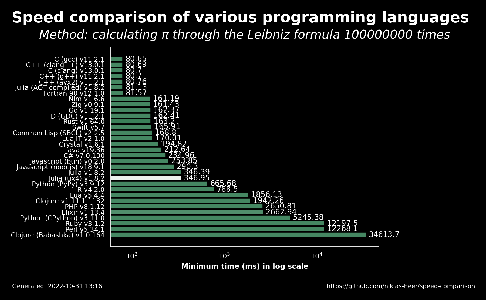

# 2022-10-31 13:16:35

## Speed comparison results

These are the latest speed comparison results of various programming languages.

### Raw results

| name                 | version     | median   | min      | max      | accuracy |
| -------------------- | ----------- | -------- | -------- | -------- | -------- |
| C (gcc)              | 11.2.1      | 80.7     | 80.65    | 80.8     | 8.4968   |
| C++ (clang++)        | 13.0.1      | 80.72    | 80.69    | 80.81    | 8.4972   |
| C (clang)            | 13.0.1      | 80.71    | 80.7     | 80.86    | 8.4972   |
| C++ (g++)            | 11.2.1      | 80.79    | 80.7     | 81.14    | 8.4968   |
| C++ (avx2)           | 11.2.1      | 80.78    | 80.76    | 80.85    | 8.4969   |
| Julia (AOT compiled) | 1.8.2       | 81.14    | 81.13    | 81.19    | 8.4971   |
| Fortran 90           | 12.1.0      | 81.66    | 81.57    | 81.66    | 8.4972   |
| Nim                  | 1.6.6       | 161.23   | 161.19   | 161.29   | 8.4971   |
| Zig                  | 0.9.1       | 161.75   | 161.43   | 162.27   | 8.4972   |
| Go                   | 1.19.1      | 162.52   | 162.37   | 162.56   | 8.4972   |
| D (GDC)              | 11.2.1      | 162.46   | 162.41   | 162.84   | 8.4972   |
| Rust                 | 1.64.0      | 163.33   | 163.2    | 163.38   | 8.5396   |
| Swift                | 5.7         | 165.94   | 165.91   | 167.95   | 8.4971   |
| Common Lisp (SBCL)   | 2.2.5       | 169.02   | 168.8    | 169.2    | 8.4972   |
| LuaJIT               | 2.1.0       | 170.01   | 170.01   | 170.2    | 8.4971   |
| Crystal              | 1.6.1       | 195.35   | 194.82   | 195.48   | 8.4971   |
| Java                 | 19.36       | 214.08   | 212.64   | 214.2    | 8.4972   |
| C#                   | 7.0.100     | 235.81   | 234.96   | 239.97   | 8.4972   |
| Javascript (bun)     | 0.2.0       | 255.91   | 253.85   | 257.61   | 8.4972   |
| Javascript (nodejs)  | 18.9.1      | 290.54   | 290.3    | 290.81   | 8.4972   |
| Julia                | 1.8.2       | 347.88   | 346.39   | 348.35   | 8.4971   |
| Julia (ux4)          | 1.8.2       | 347.84   | 346.95   | 349.24   | 7.7981   |
| Python (PyPy)        | 3.9.12      | 670.86   | 665.68   | 675.04   | 8.4972   |
| R                    | 4.2.0       | 789.2    | 788.5    | 800.59   | 8.4971   |
| Lua                  | 5.4.4       | 1856.33  | 1856.13  | 1864.19  | 8.4971   |
| Clojure              | 1.11.1.1182 | 1960.02  | 1942.26  | 2018.93  | 8.4972   |
| PHP                  | 8.1.12      | 2662.71  | 2650.81  | 2670.83  | 8.4972   |
| Elixir               | 1.13.4      | 2672.02  | 2662.94  | 2675.48  | 8.4326   |
| Python (CPython)     | 3.11.0      | 5254.47  | 5245.38  | 5288.24  | 8.4972   |
| Ruby                 | 3.1.2       | 12224.48 | 12197.54 | 12302.81 | 8.4971   |
| Perl                 | 5.34.1      | 12279.93 | 12268.15 | 12470.55 | 8.4971   |
| Clojure (Babashka)   | 1.0.164     | 34620.95 | 34613.73 | 34779.37 | 8.4972   |
